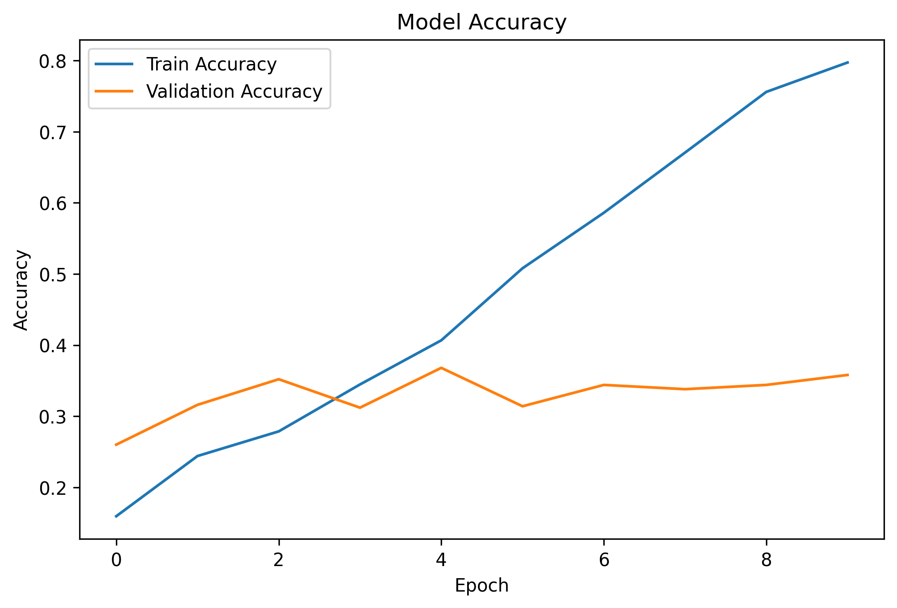
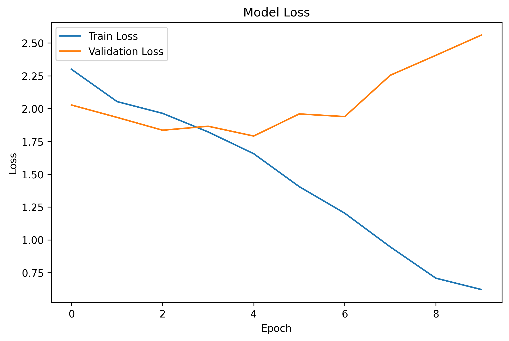
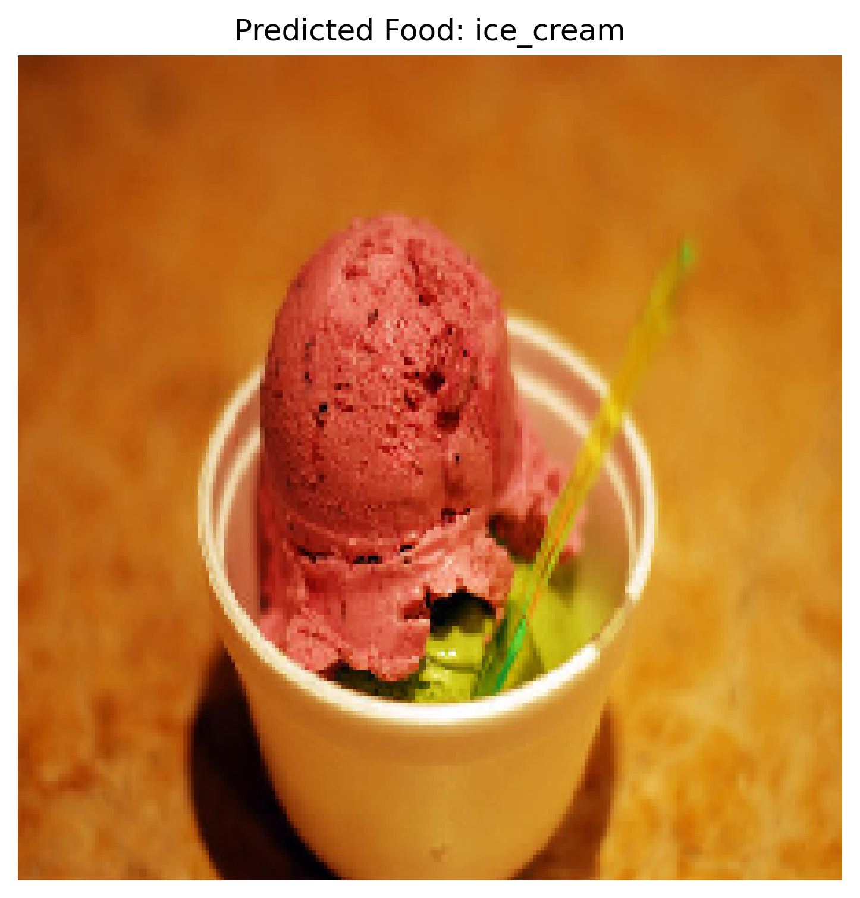

# 🍔 Food Recognition and Calorie Estimation using CNN

## 📌 Project Overview

This project is developed as part of the **Prodigy InfoTech Machine Learning Internship (Task 05)**.

The objective of this project is to build a **Food Recognition Model** using a Convolutional Neural Network (CNN) that can identify food items from images. The model is trained on a food image dataset and can classify images into multiple food categories.

This system can be further extended for calorie estimation, diet monitoring, and smart nutrition applications.

---

## 🎯 Problem Statement

Develop a machine learning model capable of recognizing food items from images and classifying them into their respective categories using deep learning techniques.

---

## 🚀 Features

- Food image classification using CNN
- Image preprocessing and normalization
- Dataset loading using TensorFlow
- Model training and validation
- Accuracy and loss visualization
- Prediction on custom food images
- Model saving for future use
- GitHub project deployment

---

## 🛠️ Technologies Used

- Python
- TensorFlow / Keras
- NumPy
- Matplotlib
- Jupyter Notebook
- VS Code

---

## 📂 Project Structure

```text
PRODIGY_ML_05/
│
├── PRODIGY_ML_05.ipynb
├── screenshots/
│   ├── accuracy_graph.png
│   ├── loss_graph.png
│   └── prediction.png
│
├── README.md
├── requirements.txt
└── food_model.keras
```

---

## 📊 Dataset

The model is trained on a food image dataset containing multiple food categories.

### Classes Used

- Apple Pie
- Bibimbap
- Cannoli
- Edamame
- Falafel
- French Toast
- Ice Cream
- Ramen
- Sushi
- Tiramisu

### Dataset Split

| Dataset | Images |
|----------|----------|
| Training | 1500 |
| Validation | 500 |
| Total | 2000 |

---

## 🧠 CNN Architecture

The model consists of:

### Input Layer
- Image Size: 224 × 224 × 3

### Convolution Layers

- Conv2D (32 filters, ReLU)
- MaxPooling2D

- Conv2D (64 filters, ReLU)
- MaxPooling2D

- Conv2D (128 filters, ReLU)
- MaxPooling2D

### Fully Connected Layers

- Flatten Layer
- Dense Layer (128 neurons)
- Dropout Layer (0.3)
- Output Layer (Softmax)

---

## ⚙️ Model Compilation

```python
model.compile(
    optimizer='adam',
    loss='sparse_categorical_crossentropy',
    metrics=['accuracy']
)
```

---

## 🏋️ Model Training

```python
history = model.fit(
    train_ds,
    validation_data=valid_ds,
    epochs=10
)
```

### Training Results

- Training Accuracy: ~79%
- Validation Accuracy: ~35%
- Epochs: 10

---

## 📈 Accuracy Graph

The following graph shows training and validation accuracy during model training.



---

## 📉 Loss Graph

The following graph shows training and validation loss during model training.



---

## 🔍 Food Prediction

Example prediction using a custom image:

### Input Image

Food Image: Ice Cream

### Model Prediction

```text
Predicted Food: ice_cream
```



---

## 💾 Saving the Model

```python
model.save("food_model.keras")
```

---

## ▶️ How to Run

### Clone Repository

```bash
git clone https://github.com/GaikwadGayatri16/PRODIGY_ML_05.git
```

### Navigate to Project

```bash
cd PRODIGY_ML_05
```

### Install Dependencies

```bash
pip install -r requirements.txt
```

### Run Jupyter Notebook

```bash
jupyter notebook
```

Open:

```text
PRODIGY_ML_05.ipynb
```

---

## 📋 Future Enhancements

- Transfer Learning using MobileNetV2
- Real-time food detection
- Calorie estimation system
- Mobile application integration
- Nutrition recommendation system

---

## 🎓 Internship Information

**Organization:** Prodigy InfoTech

**Domain:** Machine Learning

**Task:** Task 05 – Food Recognition and Calorie Estimation

**Intern:** Gayatri Gaikwad

---

## 📜 Conclusion

A Convolutional Neural Network (CNN) was successfully developed to classify food images into different categories. The model was trained, evaluated, and tested on custom food images. This project demonstrates the practical application of Deep Learning and Computer Vision in food recognition systems.

---

### ⭐ If you found this project useful, please give it a star on GitHub.
